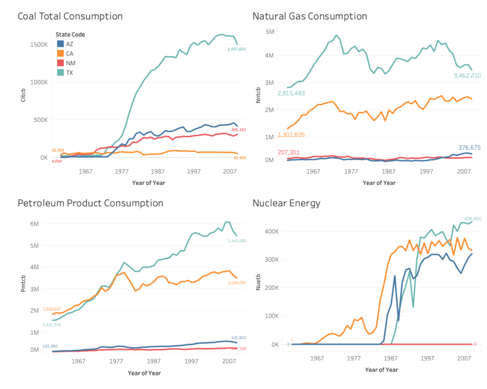

# Analysis-and-Prediction-of-Energy-Utilization-in-California-Arizona-New-Mexico-and-and-Texas
The description of energy profiles of Arizona, California, New Mexica and Texas is provided in the analysis.

The description of energy profiles of Arizona, California, New Mexica and Texas is provided in the analysis. We compared the total consumption of Renewable vs Non-Renewable resources from 1960 to 2009 to get insight about the consumption of resources in each of the state Year on Year. Then compared energy by different sectors mainly residential, transportation, commercial and industrial to see which sector consumes more electricity in these States. The figure below shows the energy consumption of various things discussed above. 

**Renewable Resources**

**Non-Renewable Resources**

**By Sector**

Next, we see how the energy profile look for each of the states. 

**Arizona**
 

**California**

**New Mexico**

**Texas**

 
 
We started with 605 variables and eliminated the variables that were not important in our analysis. Then we converted the data from long to wide in order to have a better understanding of the variables.

We studied about energy scenario in the 4 states in detail and predicted the renewable energy usage for

In future, we will like to use Principal Component analysis for feature reduction and feature elimination to come with a set of variables that are important and build a model based on these variables.
